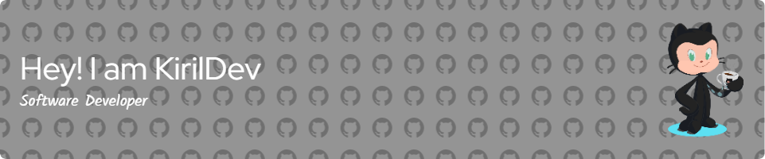

# The GitHub Account KirilDev was created a year ago (22 February 2023).

The one of First Repositories was the Summer Game Jam Project [Link to Project](https://github.com/KirilDev/The-Game-Jam-Project)

In 2023 I Created || Learned:
* Try Android Development
* Try Flutter Development
* Try Front-End Development
* Try Game Development and spend more than 7 Months working at Young Folks Studio as an unpaid Developer
* Take a Part in Gun Game Jam 2023 in Summer Time.
* Visit the Ubuntu Summit 2023 Conference and learn more about Open-Source, Linux, and Ubuntu especially + Find new Connections

#Finally in 2023 I built and published:
* Starbucks UI Flutter App
* Flutter App to Learn Lists Widget
* Simple PWA Web Application
* Portfolio Website
* Some C++ and Java Applications
* And, of course, the Game Jam Project

  #What I aspect from 2024 **and this** date:
    * In-depth Flutter and Android Development
    * Continie Study Computer Science (For Example, Take CS50 2024)
    * Learn One Programming Language (Maybe Python, JavaScript, or Rust) to learn basics and study CS
    * Create more Projects
    * Try new directions: Back-End, Cloud Computing, .NET Technologies (and Try UI/UX design, 3D Modeling)
    * Find First Paid Internship
    * Start Studying at RTK (Rigas Tehniska Koledza)
    * and more...
 
